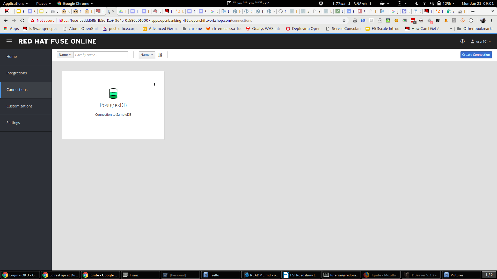
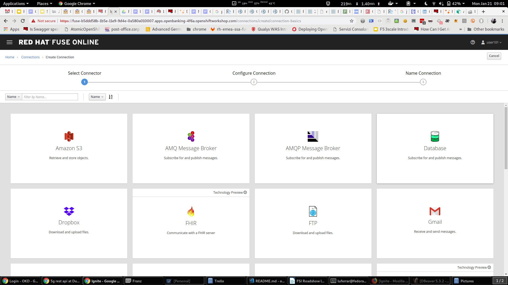
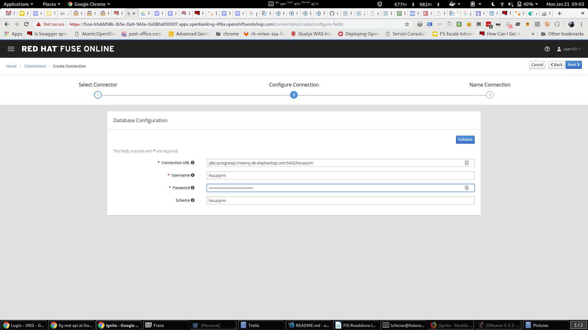
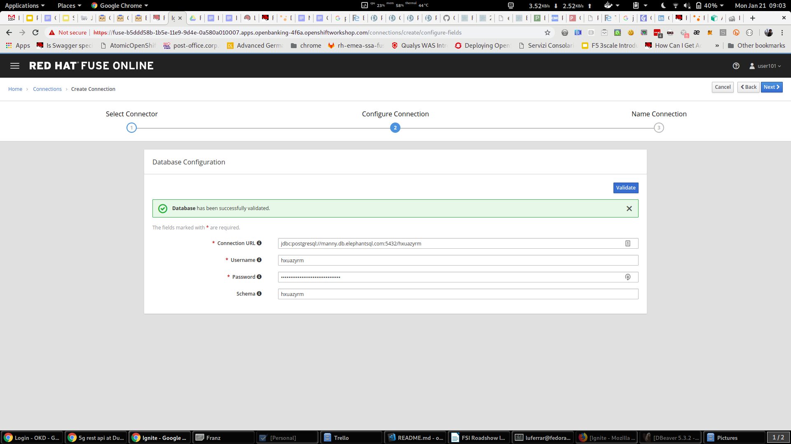
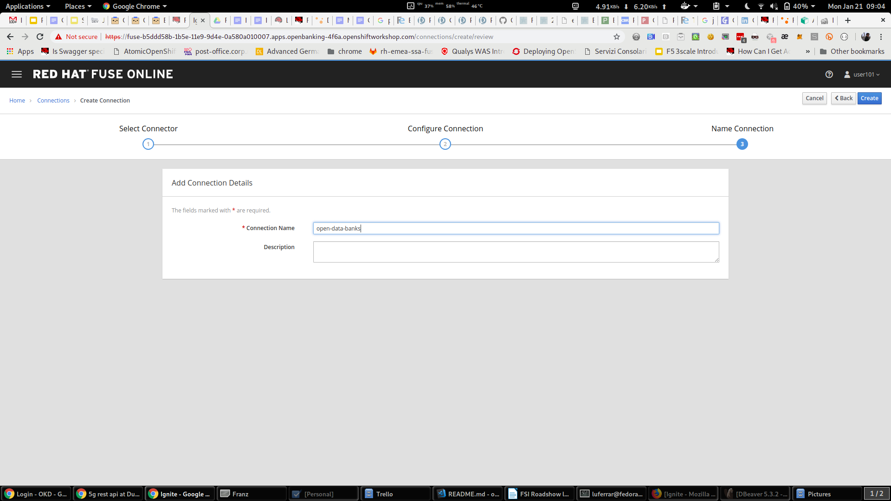
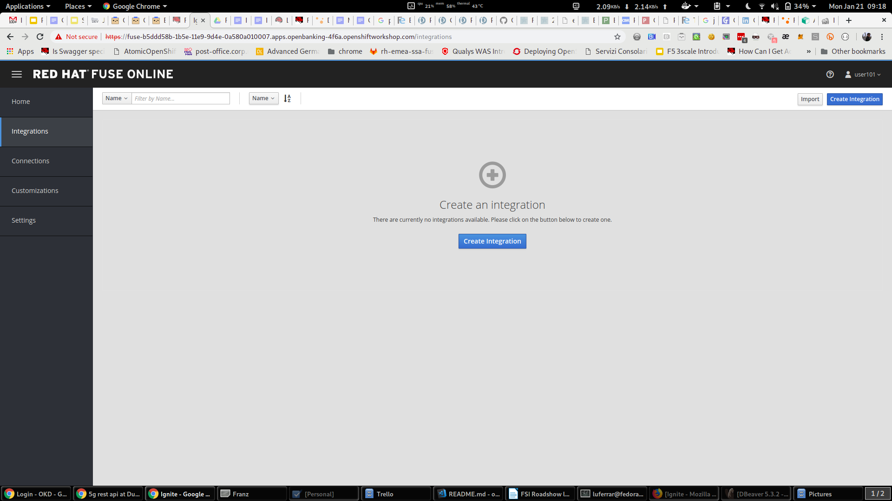

// Attributes
:integreatly: Integreatly
:integration-service: Fuse
:integration-service-version: 7.2
:api-mgmt-service: 3Scale
:sso-service: SingleSignOn
:Fuse-prodnamefull: Red Hat Fuse Online
:Fuse-version: 7.2
:3Scale-ProductName: Red Hat 3scale
:3Scale-ProductVersion: 2.4
:SingleSignOn-ProductName: Red Hat Single Sign On
:SingleSignOn-ProductVersion: 7.2
:walkthrough: Designing, deploying and protecting Open Banking APIs
:apitester-url: https://apitester.com/

= Designing, deploying and protecting Open Banking APIs

:context: integrating-api-driven-applications

The focus of this walthrough is on to use the basic building blocks provided in Integrately 
to build a comprehensive financial solution. 

Financial organizations modernizing their applications typically create many APIs. This is also a direct
result of the push coming from innovation drives and compliance and external regulation.
Given the content of these APIs it becomes paramount to ensure that they are protected and correctly managed.
In this integration you will also see how to apply more complex security protocol like OpenID Connect to these APIs.

The walkthrough shows how to deploy, edit and protect a Fuse exposed API, using {sso-service} and {api-mgmt-service}.

[type=walkthroughResource,serviceName=fuse]
.Fuse Online
****
* link:{fuse-url}[Console, window="_blank"]
****

[type=walkthroughResource,serviceName=3scale]
.3Scale
****
* link:{api-management-url}[Console, window="_blank"]
* link:https://developers.redhat.com/products/3scale/overview/[3Scale Overview, window="_blank"]
* link:https://www.3scale.net[3Scale Website, window="_blank"]
****

[type=walkthroughResource,serviceName=sso]
.Single Sign On
****
* link:{sso-url}[Console, window="_blank"]
****

:sectnums:

[time=20]
== Financial Backend Service

This first session will take us to the creation of a simple REST service
from a database source. This is quite a common scenario and one that
goes well for quick prototyping service scenarios.

=== Database connection

Let’s start by creating the connection to an existing DB that was
previously created. It is a DBaaS built on PostgreSQL and hosted on
ElephantSQL. You could be running this anywhere else, as long as you
have a public direct connection to the DB to use.

. open a browser and log into link:{fuse-url}[{integration-service}, window="_blank"] window
. click on *Connections* and then *Create connection*

. select *Database* connector

. use the following connection details and validate them:
    * Connection details:
    * jdbc:postgresql://manny.db.elephantsql.com:5432/hxuazyrm
    * username: hxuazyrm
    * password: eiHvH6xbZ2_DRdeoAu_tLbNe3des_NUf
    * schema: hxuazyrm

. let’s name the connection and finalize the configuration of the connector (click *Create*)

image:images/27f751a316bb458c.png[connection_create,role="integr8ly-img-responsive"]

We can now use this connection as an integration starting, middle or
finishing point.

=== Integration building
Now that we have configured the end of the integration path we want to
build and we will see where to find the start and we will put the two
pieces together. 

. click on *Integrations* and then *create integration*

We will start by exposing a REST endpoint that will then get mapped to
the backend datasource.

Use the *API Provider* connector with the following OpenAPI file:

https://raw.githubusercontent.com/lucamaf/open-banking-roadshow/master/open-data-apis-nokey.json[https://raw.githubusercontent.com/lucamaf/open-banking-roadshow/master/open-data-apis-nokey.json]

image:INTERNAL%20ONLY%20-%20github%20master%20instructions%20-%20FSI%20Roadshow%20lab%20notes_html_ed8669f693bd4125.png[image,width=630,height=321]

 +

 +

image:INTERNAL%20ONLY%20-%20github%20master%20instructions%20-%20FSI%20Roadshow%20lab%20notes_html_b0394fb1d4aa76f1.png[image,width=563,height=280]

The definition is the same one seen on the Open Banking solution portal
for Open Data APIs.

There is a validation happening on the API definition, but no error was
identified so we can proceed with the configuration of the connector.

To show how easy it is to correct definitions *-> review/edit*

image:INTERNAL%20ONLY%20-%20github%20master%20instructions%20-%20FSI%20Roadshow%20lab%20notes_html_ab579bf7c7c7a970.png[image,width=624,height=295]

This opens a window on Apicurito which is a scaled down version of
Apicurio, our API Design platform. It is fairly easy to change elements
graphically and also with the help of this tool an API team can start
with a Design First approach when configuring the API. Also the same
team doesn’t need to know about the rules around OpenAPI specifications
thanks to this tool.

The service is exposed without any protection (that’s one of the reasons
we are going to be using 3scale later on) since the API definition is
not adding any authentication on top of it by default.

Name the integration.

image:INTERNAL%20ONLY%20-%20github%20master%20instructions%20-%20FSI%20Roadshow%20lab%20notes_html_779b713f06dc279c.png[image,width=608,height=272]

And *save and continue*

image:INTERNAL%20ONLY%20-%20github%20master%20instructions%20-%20FSI%20Roadshow%20lab%20notes_html_e32edb47852d1741.png[image,width=624,height=182]

 +

We are going to map just one of the endpoint exposed, in particular the
_get banks_ (/banks) one.

 +

image:INTERNAL%20ONLY%20-%20github%20master%20instructions%20-%20FSI%20Roadshow%20lab%20notes_html_47e3c25deb708969.png[image,width=624,height=254]

Click on *get list of banks*

image:INTERNAL%20ONLY%20-%20github%20master%20instructions%20-%20FSI%20Roadshow%20lab%20notes_html_22764bfa357fbe17.png[image,width=624,height=192]

We now have a dumb pipe which connects an endpoint to receive user
requests and return always 200 (all OK) - the return blue arrow symbol.
Not very useful integration but a starter!

Let’s connect this front end to the database we previously configured as
a terminating connection.

*Add a connection*

image:INTERNAL%20ONLY%20-%20github%20master%20instructions%20-%20FSI%20Roadshow%20lab%20notes_html_46d6df461e6c631a.png[image,width=601,height=310]

Click on the previously configured data source.

image:INTERNAL%20ONLY%20-%20github%20master%20instructions%20-%20FSI%20Roadshow%20lab%20notes_html_21b2ac307322cf20.png[image,width=602,height=270]

And we will invoke a simple SQL statement to return the data from a
single table.

 +

image:INTERNAL%20ONLY%20-%20github%20master%20instructions%20-%20FSI%20Roadshow%20lab%20notes_html_b6979e02c028afc0.png[image,width=595,height=261]

The simple statement to introduce is:

_select * from banks_

 +

When you click *done* the statement will validate and you should be able
to proceed with the configuration of the integration.

image:INTERNAL%20ONLY%20-%20github%20master%20instructions%20-%20FSI%20Roadshow%20lab%20notes_html_5fb99be3a08333a3.png[image,width=624,height=218]

And now let’s add a simple log of the requests coming through. Add a
step.

image:INTERNAL%20ONLY%20-%20github%20master%20instructions%20-%20FSI%20Roadshow%20lab%20notes_html_82b4ed0da7a5fd2.png[image,width=624,height=196]

Select the log step.

image:INTERNAL%20ONLY%20-%20github%20master%20instructions%20-%20FSI%20Roadshow%20lab%20notes_html_98581be0c5f2ec73.png[image,width=624,height=193]

We are going to be sending a copy of the responses coming through to the
integration log.

 +

image:INTERNAL%20ONLY%20-%20github%20master%20instructions%20-%20FSI%20Roadshow%20lab%20notes_html_9ba03875f242b5e0.png[image,width=624,height=182]

We are going to log just the message body.

image:INTERNAL%20ONLY%20-%20github%20master%20instructions%20-%20FSI%20Roadshow%20lab%20notes_html_1e4a2d5544d458c1.png[image,width=624,height=231]

We are now ready to deploy and expose this integration in our platform,
to use it. Hit *Publish*

image:INTERNAL%20ONLY%20-%20github%20master%20instructions%20-%20FSI%20Roadshow%20lab%20notes_html_ad4c8088051091f7.png[image,width=624,height=195]

You can check the progress in building the integration changing through
phases.

We can notice the platform is getting the required components and
constructing the block. When the building is completed we can test the
Integration block.

 +

_SINCE AUTO DISCOVERY FEATURE IS ACTIVE WE WILL NOT GET AUTOMATICALLY A
URL WITH THE INTEGRATION BUILDING PROCESS, BUT API MANAGEMENT WILL BE
ABLE TO SEE IT AND EXPOSE IT ANYWAYS_

 +

Now that we have seen how to build the full integration you can test the
integration just built, using this online tool
https://apitester.com/[https://apitester.com/] . You can use the
following URL to test it
https://open-data.b9ad.pro-us-east-1.openshiftapps.com/open-data/banks[]http://i-db2rest-fuse-7df78d66-28d4-11e9-aad0-0a580a010007.apps.openbanking-fe8e.openshiftworkshop.com/[http://i-db2rest-fuse-7df78d66-28d4-11e9-aad0-0a580a010007.apps.openbanking-fe8e.openshiftworkshop.com]

 +

API tester works as a full Web or Mobile application but stripped down
of the GUI.

image:INTERNAL%20ONLY%20-%20github%20master%20instructions%20-%20FSI%20Roadshow%20lab%20notes_html_4a8146fd0ad53451.png[image,width=591,height=393]

Populate the fields with the following URL

http://i-db2rest-fuse-7df78d66-28d4-11e9-aad0-0a580a010007.apps.openbanking-fe8e.openshiftworkshop.com/open-data/banks

and hit *Test*

image:INTERNAL%20ONLY%20-%20github%20master%20instructions%20-%20FSI%20Roadshow%20lab%20notes_html_5b1e8edd4c2fd8cb.png[image,width=570,height=378]

Show that everything went 200 fine and open the Response Body (eye icon)

image:INTERNAL%20ONLY%20-%20github%20master%20instructions%20-%20FSI%20Roadshow%20lab%20notes_html_83a67bd30b02d5f2.png[image,width=476,height=95]

The response is in JSON format, with basic information given around
banks (dummy data).

[[scale]]
[[_1t3h5sf]]3scale
++++++++++++++++++

To reach 3scale as a user you can just go back to the main integr8ly
tutorial dashboard and click on 3scale. You will be presented with the
login window and can use you previously used user credentials.

Introducing now 3scale, for the purpose of managing these exposed APIs,
securing them and tracking their usage. *Dashboard*

Everybody when logging in act as an administrator or API provider. The
dashboard will show a summary of the trends in usage of the platform, in
terms of developers signups, usage of APIs and message sent and
received.

 +

image:INTERNAL%20ONLY%20-%20github%20master%20instructions%20-%20FSI%20Roadshow%20lab%20notes_html_fbbdd08773f7d951.png[image,width=624,height=317]

 +

Let’s start managing and protecting the API we just created on Fuse
Online.

Click on the green button *New API* and select *Import from OpenShift*
(click on *Authenticate to enable this option*). ** We are going to be
using the
https://en.wikipedia.org/wiki/Service_discovery[auto-discovery] feature
we saw before. We would be helped by this feature and would save time
configuring the service.

 +

image:INTERNAL%20ONLY%20-%20github%20master%20instructions%20-%20FSI%20Roadshow%20lab%20notes_html_7ea5a1314c59ec66.png[image,width=565,height=315]

 +

You are now presented with the permissions screen and you should click
the _Allow selected permissions_ button to proceed. This is to allow API
management to go and look for services in our container platform.

 +

image:INTERNAL%20ONLY%20-%20github%20master%20instructions%20-%20FSI%20Roadshow%20lab%20notes_html_d60df648c3a5608c.png[image,width=615,height=171]

 +

You will now see the auto-discovered Fuse service appear in the
_Namespace_ field. Click the blue *Create Service* button and proceed in
starting the service configuration.

 +

image:INTERNAL%20ONLY%20-%20github%20master%20instructions%20-%20FSI%20Roadshow%20lab%20notes_html_110f274df1b4c611.png[image,width=624,height=241]

You will be redirected to the Dashboard view where a success message
should appear as shown in the following screenshot.

 +

image:INTERNAL%20ONLY%20-%20github%20master%20instructions%20-%20FSI%20Roadshow%20lab%20notes_html_2c4bc51aa8e15fca.png[image,width=624,height=144]

Once the service is created you will see that in the dropdown menu where
you can also see *Audience.*

 +

We can now proceed on changing the details of the configuration of the
API and publish the update on the Developer Portal so that the public
Developers can sign up for the open financial API.

*API-> Integration-> Configuration*

image:INTERNAL%20ONLY%20-%20github%20master%20instructions%20-%20FSI%20Roadshow%20lab%20notes_html_9fd97b34ec6b2225.png[image,width=624,height=324]

This is where you configure the rest of the details of the mapped and
protected Service. The private base URL should already be filled with
the details coming from the auto-discovery feature.

image:INTERNAL%20ONLY%20-%20github%20master%20instructions%20-%20FSI%20Roadshow%20lab%20notes_html_8bac22906f51784f.png[image,width=623,height=343]

We have the section where we map the Backend API (or in this case
Integration service) and then 2 URLs where we expose the managed API on
the staging first and production gateways or infrastructure. We will be
changing the Staging and Public addresses of the gateway. In this case
we are not going to use separate staging or public infrastructure so it
can be the same address (please notice the format of the staging and
public base url for the gateways
https://userX.amp.apps.openbanking-fe8e.openshiftworkshop.com)

image:INTERNAL%20ONLY%20-%20github%20master%20instructions%20-%20FSI%20Roadshow%20lab%20notes_html_ce482302584bc0be.png[image,width=618,height=257]

We will now make sure we map a single endpoint or resource in 3scale and
disallow any other endpoint (i.e. the other endpoints have not been
implemented yet so we are protecting them from being exposed).

 +

The endpoint you want to map is /open-data/banks$ (notice the $ at the
end of the path that will allow us to make sure users cannot improperly
access any other sub-resource). We can now check and change the
configuration of authentication settings.

image:INTERNAL%20ONLY%20-%20github%20master%20instructions%20-%20FSI%20Roadshow%20lab%20notes_html_26af3be6a8c9a397.png[image,width=624,height=251]

We see that we have already api key protection enabled, but we might
want to pass this information as HTTP Header instead of HTTP parameter.
We will also change the header name to ‘key’

image:INTERNAL%20ONLY%20-%20github%20master%20instructions%20-%20FSI%20Roadshow%20lab%20notes_html_cf46394b49ceedd3.png[image,width=624,height=273]

You can also customize the error returned to the end user. *Policies*

image:INTERNAL%20ONLY%20-%20github%20master%20instructions%20-%20FSI%20Roadshow%20lab%20notes_html_da30bcf933e150f0.png[image,width=624,height=300]

These are like additional plugin that you can configure to adapt the
service to your own preference. *Add Policy*

image:INTERNAL%20ONLY%20-%20github%20master%20instructions%20-%20FSI%20Roadshow%20lab%20notes_html_94e8c7035d81dcc8.png[image,width=624,height=304]

Several policies are available and the list is always increasing. Two
policies / functionalities are of importance: SOAP policy to map SOAP
services and advanced rate limit functionalities with edge limiting
policy. Update the API test GET request field with the same pattern you
are mapping above (excluding the $).

 +

Hitting the big blue button will allow you to do two things at once:

* Update the service configuration on the platform
* Test the configuration just uploaded to the gateway.

The second one will fail since we are not providing any valid key, so we
will get unauthorized request but the gateway will receive the updated
configuration in any case.

image:INTERNAL%20ONLY%20-%20github%20master%20instructions%20-%20FSI%20Roadshow%20lab%20notes_html_9fe54b4583cb1150.png[image,width=624,height=278]

We will now fix the test request error as advised by the warning
message.

Let’s switch to explaining the role of API contracts of Application
Plans.

 +

Now from the Service overview page click the green link _Create
application plan_. Since we are creating a Service we will need to offer
a way for Developers to subscribe to it and use it. Application plan are
the way to do that (also known as API Contracts).

 +

image:INTERNAL%20ONLY%20-%20github%20master%20instructions%20-%20FSI%20Roadshow%20lab%20notes_html_acb4f3c100480178.png[image,width=624,height=324]

Fill out the *Name* and *System Name* fields on the *create application
plan* form and click the blue button to submit the form.

You can safely ignore for now the monetization options and use whichever
name you prefer.

image:INTERNAL%20ONLY%20-%20github%20master%20instructions%20-%20FSI%20Roadshow%20lab%20notes_html_616acb12bebd94f5.png[image,width=624,height=315]

 +

 +

 +

image:INTERNAL%20ONLY%20-%20github%20master%20instructions%20-%20FSI%20Roadshow%20lab%20notes_html_4e368ec757201950.png[image,width=624,height=211]

We see that we have 1 API contract (or Application Plan), but no
application associated to it. The application plans are in **hidden**
state by default, so let’s publish this one so that it is usable and
visible on the Developer portal. Let’s open the application plan.

image:INTERNAL%20ONLY%20-%20github%20master%20instructions%20-%20FSI%20Roadshow%20lab%20notes_html_668958cd9c28fd37.png[image,width=624,height=295]

Main elements:

* Monetization settings (trial, setup, cost per month)
* Endpoint mapped (in this case generic Hits) and relative monetization
and rate limiting settings

Don’t modify anything beside filling _Name_ and _System name_.

image:INTERNAL%20ONLY%20-%20github%20master%20instructions%20-%20FSI%20Roadshow%20lab%20notes_html_cf19f879103a7b28.png[image,width=624,height=228]

We can now switch to the Audience tab to create an Application to test
the Configuration, by clicking on Listing.

image:INTERNAL%20ONLY%20-%20github%20master%20instructions%20-%20FSI%20Roadshow%20lab%20notes_html_c0d600426b8fb315.png[image,width=632,height=203]

From here we can see how we can, as Provider, approve or deny
Developers’ Accounts registrations. Let’s click on the default
*Developer *Account

image:INTERNAL%20ONLY%20-%20github%20master%20instructions%20-%20FSI%20Roadshow%20lab%20notes_html_ea040015c56d65d6.png[image,width=624,height=301]

We can see that the Developer has the default application associated,
but it’s subscribed to the default Service. We can also see the
Developer user details.

Let’s click on * *Applications* *in the top level navigation and*
*Create application

image:INTERNAL%20ONLY%20-%20github%20master%20instructions%20-%20FSI%20Roadshow%20lab%20notes_html_498ec8af8c7c1f6f.png[image,width=624,height=109]

image:INTERNAL%20ONLY%20-%20github%20master%20instructions%20-%20FSI%20Roadshow%20lab%20notes_html_e6825c2ff83122dd.png[image,width=624,height=276]

Here we can now subscribe the application to the *Application plan* we
created on our new Service from the drop down field available. Let’s
fill in the rest of the fields with some basic details and click the big
blue button: *Create Application*.

 +

We now have an assigned key so we can go back to the Configuration
window of the API service and make a successful test call. *API ->
Integration -> edit Apicast configuration*

image:INTERNAL%20ONLY%20-%20github%20master%20instructions%20-%20FSI%20Roadshow%20lab%20notes_html_38ce69d07b691c0c.png[image,width=633,height=284]

We now have a pre-populated key in the example curl statement, let’s try
again testing the deployed configuration.

image:INTERNAL%20ONLY%20-%20github%20master%20instructions%20-%20FSI%20Roadshow%20lab%20notes_html_521ac6bcced523b3.png[image,width=619,height=271]

As we can see we turned the testing into a success.

Let’s switch to the developers’ point of view by accessing the Developer
portal. You can access it by selecting in to the top menu in *Audience
->* *Developer portal -> Visit Developer Portal*

The sidebar allows us to edit pages of the Developer Portal live, but we
are not interested in it now so we can close it.

image:INTERNAL%20ONLY%20-%20github%20master%20instructions%20-%20FSI%20Roadshow%20lab%20notes_html_9081532fd1071a54.png[image,width=624,height=248]

Let’s sign in with the default user credentials provided in the sidebar.
This is the default developer user, created for the default developer
account [john / 123456]

image:INTERNAL%20ONLY%20-%20github%20master%20instructions%20-%20FSI%20Roadshow%20lab%20notes_html_7484dcb96be36e7f.png[image,width=624,height=328]

We are now logged in the developer’s dashboard. Let’s see the
Applications I have created

image:INTERNAL%20ONLY%20-%20github%20master%20instructions%20-%20FSI%20Roadshow%20lab%20notes_html_e17389bfabb24528.png[image,width=624,height=257]

I can now use the credential that I have associated with the application
and test the protected service. Let’s move to the online API testing
tool, https://apitester.com/

image:INTERNAL%20ONLY%20-%20github%20master%20instructions%20-%20FSI%20Roadshow%20lab%20notes_html_d844d76199032049.png[image,width=564,height=348]

Use the URL for your API gateway, the following format should be
configured in your service already:
https://userX.amp.apps.openbanking-fe8e.openshiftworkshop.com , remember
the the key Header and the associated value.

 +

image:INTERNAL%20ONLY%20-%20github%20master%20instructions%20-%20FSI%20Roadshow%20lab%20notes_html_6b9b83227e4b5c61.png[image,width=624,height=293]

As we can see we succeed with 200 OK!

Let’s now just test with a wrong key or path then to confirm the role of
API Management.

image:INTERNAL%20ONLY%20-%20github%20master%20instructions%20-%20FSI%20Roadshow%20lab%20notes_html_96dbe78ea40a3465.png[image,width=624,height=299]

As expected we receive a Forbidden error.

[[checkpoint]]
[[_4d34og8]]Checkpoint
^^^^^^^^^^^^^^^^^^^^^^

image:INTERNAL%20ONLY%20-%20github%20master%20instructions%20-%20FSI%20Roadshow%20lab%20notes_html_fddc0fee533b6ed5.png[image,width=624,height=73]

[[break]]
[[_sy47th3sxp9y]]Break
^^^^^^^^^^^^^^^^^^^^^^

[[practical-part-2]]
[[_3qh7sn1k6dwm]]Practical Part 2
^^^^^^^^^^^^^^^^^^^^^^^^^^^^^^^^^

[[rh-sso-and-3scale-oidc]]
[[_2s8eyo1]]RH SSO and 3SCALE OIDC
++++++++++++++++++++++++++++++++++

Let’s now improve the security of the managed integration service with
OIDC. API key is not really considered a safe method anymore and is
vulnerable to many attacks.

After introducing content around OAuth and OIDC, let’s see the main
elements of RH SSO itself.

 +

SINCE AS INTEGR8LY USERS YOU DON’T HAVE ACCESS TO THE RELATED RH SSO
REALM, YOU ARE GOING TO SEE HOW TO CONFIGURE A RH SSO CLIENT THAT WILL
THEN BE USED BY EVERYBODY IN THEIR 3SCALE OIDC CONFIGURATION.

[[demo-only]]
[[_y3lpn8vugcng]] DEMO ONLY

 +

Let’s start with RH SSO main dashboard

http://sso.apps.openbanking-fe8e.openshiftworkshop.com/auth/[http://sso.apps.openbanking-fe8e.openshiftworksho]http://sso.apps.openbanking-fe8e.openshiftworkshop.com/auth/[p.com/auth/]

image:INTERNAL%20ONLY%20-%20github%20master%20instructions%20-%20FSI%20Roadshow%20lab%20notes_html_8831e631641c6339.png[image,width=620,height=295]

The realms are like separate instances of the platform, dedicated to
separating users and applications. As we can see we can customize
several aspects of the realm like the theme of the login page or the the
tokens’ default parameters. *Endpoints -> OpenID Endpoint Configuration*

 +

image:INTERNAL%20ONLY%20-%20github%20master%20instructions%20-%20FSI%20Roadshow%20lab%20notes_html_e28d9c693abafded.png[image,width=560,height=323]

This is where we can find the public endpoints of the Realm exposed by
RH SSO (we are going to be using this later).

Let’s now take a look at the Clients section.

image:INTERNAL%20ONLY%20-%20github%20master%20instructions%20-%20FSI%20Roadshow%20lab%20notes_html_fd48e097b178ebbe.png[image,width=624,height=203]

Here we can configure the web or mobile applications that will
authenticate using RH SSO as an IDP (corresponding to applications in
3scale). As we can see there are some default clients dedicated to
authentication in the integr8ly environment.

 +

Users -> View all users

image:INTERNAL%20ONLY%20-%20github%20master%20instructions%20-%20FSI%20Roadshow%20lab%20notes_html_2324d65796ea09f4.png[image,width=624,height=270]

Here we can see all the end users that are stored inside RH SSO, making
it act as an IDM as well. These are the end users of the applications
created in the Clients section and they will be able to authenticate
through them. Let’s open one of these users’ details.

image:INTERNAL%20ONLY%20-%20github%20master%20instructions%20-%20FSI%20Roadshow%20lab%20notes_html_7efedd3c16f5656b.png[image,width=520,height=238]

We can see here the type of information stored along with basic user
details. The user profile can be customized with additional attributes
as well.

 +

 +

We will take advantage of one of the features available in OIDC and not
in OAUTH which is dynamic client registration.

Normally to make sure an API web application authenticates with RH SSO,
we would need to manually create the application on both platforms. With
this feature, we let 3scale sync the applications to RH SSO, as well as
obviously authenticating our API calls. Let’s create a special type of
such Client in RH SSO under Threescale realm. *Clients -> Create*

image:INTERNAL%20ONLY%20-%20github%20master%20instructions%20-%20FSI%20Roadshow%20lab%20notes_html_129b5831c04132c3.png[image,width=583,height=313]

Let’s call it sync-app and configure the other details required to let
it communicate with 3scale.

image:INTERNAL%20ONLY%20-%20github%20master%20instructions%20-%20FSI%20Roadshow%20lab%20notes_html_eab56fea4334c68b.png[image,width=465,height=352]

We are going to give it only the rights to create applications on behalf
of 3scale (_service accounts enabled_ only).

image:INTERNAL%20ONLY%20-%20github%20master%20instructions%20-%20FSI%20Roadshow%20lab%20notes_html_9807e843aeb27ec5.png[image,width=468,height=347]

*Save -> Service account roles*

Add manage-clients to the assigned roles in this window, by picking
realm-management in the Client roles menu, this special role allows it
to create application on behalf of API management. Then click add
selected

image:INTERNAL%20ONLY%20-%20github%20master%20instructions%20-%20FSI%20Roadshow%20lab%20notes_html_39390b96648e97fa.png[image,width=503,height=259]

And now we are ready to use the client credentials inside 3scale OIDC
configuration section.

To authenticate as we were an end user, we will need to create one test
user, so let’s go to the Users section and add a user

image:INTERNAL%20ONLY%20-%20github%20master%20instructions%20-%20FSI%20Roadshow%20lab%20notes_html_7e6ba75693536cb.png[image,width=624,height=207]

We will fill in all the user details and switch to user email verified

image:INTERNAL%20ONLY%20-%20github%20master%20instructions%20-%20FSI%20Roadshow%20lab%20notes_html_9b1d407842e8c6c2.png[image,width=574,height=267]

Now we will set the password, by going to credentials and setting it to
_password_ and reset password.

image:INTERNAL%20ONLY%20-%20github%20master%20instructions%20-%20FSI%20Roadshow%20lab%20notes_html_a8644b7f2fca49c5.png[image,width=604,height=279]

We have now all the elements to proceed with the corresponding
configuration on API management to authenticate calls using our RH SSO.

 +

[[lab-begins]]
[[_4rk9rjid5559]] LAB BEGINS

Let’s now switch back to 3scale to configure the API management side of
OIDC authentication.

image:INTERNAL%20ONLY%20-%20github%20master%20instructions%20-%20FSI%20Roadshow%20lab%20notes_html_2497a378b125866a.png[image,width=624,height=325]

We can see that we have a fully configured API with API key as the
Authentication method. We are going to change it to the more secure
OpenID Connect, to ensure our financial data are protected from attacks
performed when a key is compromised. *Edit integration settings*

image:INTERNAL%20ONLY%20-%20github%20master%20instructions%20-%20FSI%20Roadshow%20lab%20notes_html_68f608e7c269cf4d.png[image,width=624,height=325]

We are going to change it to OpenID Connect. *Update service*

image:INTERNAL%20ONLY%20-%20github%20master%20instructions%20-%20FSI%20Roadshow%20lab%20notes_html_bc3bd60863779aa7.png[image,width=624,height=325]

Clearly the platform is warning us that we have customers using this API
and it might break their application, changing the authentication
method. In a real world case, we would inform the developer in advance
by using the messaging and notification functionality available within
the platform.

image:INTERNAL%20ONLY%20-%20github%20master%20instructions%20-%20FSI%20Roadshow%20lab%20notes_html_2f04b14f929ec230.png[image,width=624,height=324]

We have now changed the authentication method, we are just left with
configuring the correct IdP inside 3scale to make sure it is
authenticating the requests with RH SSO. *edit apicast configuration*

image:INTERNAL%20ONLY%20-%20github%20master%20instructions%20-%20FSI%20Roadshow%20lab%20notes_html_916e89e7d700f345.png[image,width=501,height=395]

As we see we have a dedicated field for this purpose now: *OpenID
C***o***nnect Issuer*

 +

Let’s build a url of this format to use it:

http://client-id:client-secret@<idp-public-endpoint>

where client-id: sync-app

client secret: 5f8f3908-dc47-4b24-a9aa-44f6860e1144

idp-public-endpoint:
http://sso.apps.openbanking-fe8e.openshiftworkshop.com/auth/realms/threescale[sso.apps.openbanking-fe8e.openshiftworkshop.com/auth/realms/threescale]

Lastly, change the Credentials location to As HTTP Headers

And update the staging environment and promote the configuration to
production by clicking the blue button _Promote to production_.

image:INTERNAL%20ONLY%20-%20github%20master%20instructions%20-%20FSI%20Roadshow%20lab%20notes_html_d50d65d97688f892.png[image,width=624,height=264]

Let’s now switch user perspective and get in the shoes of the developer
and open their Applications section.

image:INTERNAL%20ONLY%20-%20github%20master%20instructions%20-%20FSI%20Roadshow%20lab%20notes_html_fac123499262120d.png[image,width=624,height=513]

We can see the secret of their application is absent as is the redirect
URL. We are going to generate the first and add as redirect url the
following
https://openidconnect.net/callback[https://openidconnect.net/callback]

(we are going to explain why in a moment).

image:INTERNAL%20ONLY%20-%20github%20master%20instructions%20-%20FSI%20Roadshow%20lab%20notes_html_c39ad9744bfbd9c1.png[image,width=527,height=199]

Let’s make sure that the application is now aligned in terms of
credentials both in 3scale and RH SSO.

image:INTERNAL%20ONLY%20-%20github%20master%20instructions%20-%20FSI%20Roadshow%20lab%20notes_html_f74213908594b9b1.png[image,width=624,height=325]

image:INTERNAL%20ONLY%20-%20github%20master%20instructions%20-%20FSI%20Roadshow%20lab%20notes_html_1c71f9c4b12979bd.png[image,width=614,height=266]

image:INTERNAL%20ONLY%20-%20github%20master%20instructions%20-%20FSI%20Roadshow%20lab%20notes_html_cdb9a6ebe35b05fb.png[image,width=603,height=321]

All looks good! Let’s now try to authenticate the end user, using OpenID
Connect.

We are going to need a special web client, a little bit more intelligent
than just the API tester:
https://openidconnect.net/[https://openidconnect.net/]

Let’s configure it with the correct parameters from the previous steps.
*Configuration*

Let’s change the server template to custom and input in the discovery
URL the one we opened before in our RH SSO realm

http://sso.apps.openbanking-fe8e.openshiftworkshop.com/auth/realms/threescale/.well-known/openid-configuration[http://sso.apps.openbanking-fe8e.openshiftworksho]http://sso.apps.openbanking-fe8e.openshiftworkshop.com/auth/realms/threescale/.well-known/openid-configuration[p.com/]http://sso.apps.openbanking-fe8e.openshiftworkshop.com/auth/realms/threescale/.well-known/openid-configuration[auth/realms/threescale/.well-known/openid-configuration]

And click on USE DISCOVERY DOCUMENT

We are going to use the client id and secret as from the application
created in the 3scale developer portal / 3scale admin portal or RH SSO
since they are all the same.

And lastly as scope we are going to add *openid* and *email*.
*SAVE*image:INTERNAL%20ONLY%20-%20github%20master%20instructions%20-%20FSI%20Roadshow%20lab%20notes_html_49b9879e91c55673.png[image,width=601,height=404]

Start the authentication flow by hitting start. You are going to be
redirected to the RH SSO login interface where you can use the default
user details and password we saw before (john / password). Once you
login you will receive a temporary code to be exchanged for the final
credentials or access token.

 +

image:INTERNAL%20ONLY%20-%20github%20master%20instructions%20-%20FSI%20Roadshow%20lab%20notes_html_a74a02136b460977.png[image,width=388,height=409]

Hit *Exchange*

image:INTERNAL%20ONLY%20-%20github%20master%20instructions%20-%20FSI%20Roadshow%20lab%20notes_html_803e834a46810204.png[image,width=482,height=450]

You will receive the “access_token” which is an expiring credential that
we will be using to authenticate with 3scale to get access to the
configured API using OpenID Connect. We can see that another important
piece of information is shown there regarding when this credential will
expire “expires_in”.

We can hit *NEXT* and id_token will also be shown, which contains more
user related details.

image:INTERNAL%20ONLY%20-%20github%20master%20instructions%20-%20FSI%20Roadshow%20lab%20notes_html_b1b7fdb8e4bbfd6f.png[image,width=427,height=319]

We can decode the information on the website JWT.io and found our user
details once again as passed to the Backend service.

image:INTERNAL%20ONLY%20-%20github%20master%20instructions%20-%20FSI%20Roadshow%20lab%20notes_html_f768b20c937f3600.png[image,width=473,height=288]

Let’s now go back to https://openidconnect.net/ website and copy the
“access_token” value in the step 2 (the long string).

image:INTERNAL%20ONLY%20-%20github%20master%20instructions%20-%20FSI%20Roadshow%20lab%20notes_html_58ef826168594763.png[image,width=316,height=415]

It should look something like this:

eyJhbGciOiJSUzI1NiIsInR5cCIgOiAiSldUIiwia2lkIiA6ICJRa1RJX2VwS2IwNVpFSkp3ZTd1cnFQUWtjSERNRi1SMnhGcE1tZUJ2aC1VIn0.eyJqdGkiOiIyYzJmZjQ5ZS01MDY4LTQ0MjQtYTRiNS05MWU3OTk3MTM0YTMiLCJleHAiOjE1NDczOTc1NTIsIm5iZiI6MCwiaWF0IjoxNTQ3Mzk2NjUyLCJpc3MiOiJodHRwczovL3NlY3VyZS1zc28tc3NvLmFwcHMub3Blbi1iYW5raW5nLm9wZW50cnkubWUvYXV0aC9yZWFsbXMvb3BlbnNoaWZ0IiwiYXVkIjoiNWJjOTRmNmEiLCJzdWIiOiIyMzZjZDRhMy01MGM2LTQ3YjQtYWUzZC05ODdiYjA1ZTk4MzYiLCJ0eXAiOiJCZWFyZXIiLCJhenAiOiI1YmM5NGY2YSIsImF1dGhfdGltZSI6MTU0NzM5NTg3Niwic2Vzc2lvbl9zdGF0ZSI6ImZhMTQ5YjhiLWQ0ZTktNDliZS05NWIwLTk2MTNmZjBhNTViZCIsImFjciI6IjAiLCJhbGxvd2VkLW9yaWdpbnMiOltdLCJyZWFsbV9hY2Nlc3MiOnsicm9sZXMiOlsidW1hX2F1dGhvcml6YXRpb24iXX0sInJlc291cmNlX2FjY2VzcyI6eyJhY2NvdW50Ijp7InJvbGVzIjpbIm1hbmFnZS1hY2NvdW50IiwibWFuYWdlLWFjY291bnQtbGlua3MiLCJ2aWV3LXByb2ZpbGUiXX19LCJwcmVmZXJyZWRfdXNlcm5hbWUiOiJldmFsczk4QGV4YW1wbGUuY29tIiwiZW1haWwiOiJldmFsczk4QGV4YW1wbGUuY29tIn0.O7y6GDFq5CajAT0DkywEuQqEuD5H7_YMqrVC4AMPthZ-m_xZ_DAPBEqj3mmzp1o1JOo0_4pMxNgKpyyqCQiFY79GRS5lJE6aVrZK53rQkud5dIaZAE1-ryiD8CtP_MrQtsTS7bVKbaFyCXNyFfxy3c-TER8GnGG90OlYPXpy5M954sIcp4CWXxA7ZwVEuQNRRs5w2G2TCjrFyQjCzslNFwDRtADjbMiY7kq1cwRB5qM9ipdEEIigDnH8dietiOZgY24sK10vtowjz_CHuWr5W3474dAZVFC7utwStl_bNcoj1gENRcz5cP7fH7Nim8e4itWoSVPRVYcfDHyYb9zixQ

 +
We are going to use this as a Header in our call towards the OpenID
protected service.

Let’s go back to our api tester and add this as an Authorization header.
The format is Authorization Bearer <access_token_value_here>

image:INTERNAL%20ONLY%20-%20github%20master%20instructions%20-%20FSI%20Roadshow%20lab%20notes_html_d75c81d544f50343.png[image,width=624,height=149]

Let’s hit *Test*

image:INTERNAL%20ONLY%20-%20github%20master%20instructions%20-%20FSI%20Roadshow%20lab%20notes_html_102dee4cafcf2a9a.png[image,width=467,height=292]

And success!

image:INTERNAL%20ONLY%20-%20github%20master%20instructions%20-%20FSI%20Roadshow%20lab%20notes_html_f97f9066ba9ec021.png[image,width=321,height=269]

The work done by the API management behind the curtain is quite
impressive:

* Check for the validity of the access token credentials (not expired,
legit and associated to the correct application)
* Check for rate limits on the application triggering the call
* Apply monetization rules to the call
* Apply any additional policy that might modify the call in real time
* Report the traffic back to the analytics component

 +

[[checkpoint-1]]
[[_17dp8vu]]Checkpoint
^^^^^^^^^^^^^^^^^^^^^^

Improved security to the highest grade possible while using standards.

[[section-2]]
[[_26in1rg]] +
 +
^^^^^^^^^^^^^^

[[openshift-optional]]
[[_lnxbz9]]OpenShift (optional)
+++++++++++++++++++++++++++++++

[[lab-begins-1]]
[[_whg9inix4ydb]]LAB BEGINS

As user you will login into openshift and it already looks evident that
the end user has been profiled as developer on OpenShift as he has
access only to Objects and Projects he created.

image:INTERNAL%20ONLY%20-%20github%20master%20instructions%20-%20FSI%20Roadshow%20lab%20notes_html_94cf31260f6228ed.png[image,width=624,height=271]

If we click on the fuse project we will be able to access to the Fuse
Online installation dedicated to the user. We would also be able to see
any integration project running alongside Fuse installation.

If we switch to the **C***luster console*, this will give us some
Operations details on the project created or assigned to our user.

image:INTERNAL%20ONLY%20-%20github%20master%20instructions%20-%20FSI%20Roadshow%20lab%20notes_html_f14f20fc92b1507e.png[image,width=624,height=238]

This type of console is also used by Operations administrators to check
the health of OpenShift.

We can see the RBAC in action if we click on *Home -> Status*

image:INTERNAL%20ONLY%20-%20github%20master%20instructions%20-%20FSI%20Roadshow%20lab%20notes_html_f811f2d02f057f50.png[image,width=624,height=255]

The *Project default* is excluded from the scope of any evals users,
since it can contain system components and privileged objects.

We can just switch to the Fuse project to see if there anything wrong
with it in the cluster.

image:INTERNAL%20ONLY%20-%20github%20master%20instructions%20-%20FSI%20Roadshow%20lab%20notes_html_c0cd9fdf543ff655.png[image,width=624,height=262]

We will now try as bad intentioned user to change some parameters around
the installed products.

image:INTERNAL%20ONLY%20-%20github%20master%20instructions%20-%20FSI%20Roadshow%20lab%20notes_html_83e67faa391814f8.png[image,width=624,height=275]

image:INTERNAL%20ONLY%20-%20github%20master%20instructions%20-%20FSI%20Roadshow%20lab%20notes_html_e6de76cfbb995876.png[image,width=575,height=304]

image:INTERNAL%20ONLY%20-%20github%20master%20instructions%20-%20FSI%20Roadshow%20lab%20notes_html_b769adf958203399.png[image,width=583,height=309]

As we can see we tried to kill one of the running components of our
integration platform with no success, because of the roles assigned to
my user.

[[demo-only-1]]
[[_nzbflc7w9zmo]] DEMO ONLY

Let’s see the magic introduced by OpenShift and login as administrator
of the platform once again.

image:INTERNAL%20ONLY%20-%20github%20master%20instructions%20-%20FSI%20Roadshow%20lab%20notes_html_572f00309b946a0e.png[image,width=624,height=244]

We now have full access to all the platforms from all users. We will
open as admin one of the Fuse projects and open one of the components of
Fuse Online.

image:INTERNAL%20ONLY%20-%20github%20master%20instructions%20-%20FSI%20Roadshow%20lab%20notes_html_8c0af3aadd4d88f5.png[image,width=624,height=295]

We are going to test the auto healing capabilities of the platform by
killing one if its running components, in particular the one providing
the UI service.

image:INTERNAL%20ONLY%20-%20github%20master%20instructions%20-%20FSI%20Roadshow%20lab%20notes_html_83307e94164c4000.png[image,width=624,height=284]

image:INTERNAL%20ONLY%20-%20github%20master%20instructions%20-%20FSI%20Roadshow%20lab%20notes_html_3339cc10a8054cbb.png[image,width=624,height=259]

image:INTERNAL%20ONLY%20-%20github%20master%20instructions%20-%20FSI%20Roadshow%20lab%20notes_html_1de842adeb97d45e.png[image,width=624,height=181]

image:INTERNAL%20ONLY%20-%20github%20master%20instructions%20-%20FSI%20Roadshow%20lab%20notes_html_e7b64bd1399dc5ac.png[image,width=624,height=296]

As you can see we just deleted a Pod and we will verify that UI is
broken by accessing the interface of Fuse Online

image:INTERNAL%20ONLY%20-%20github%20master%20instructions%20-%20FSI%20Roadshow%20lab%20notes_html_9fcd39bec9b5a785.png[image,width=624,height=208]

image:INTERNAL%20ONLY%20-%20github%20master%20instructions%20-%20FSI%20Roadshow%20lab%20notes_html_243134ddf7069bc8.png[image,width=624,height=292]

image:INTERNAL%20ONLY%20-%20github%20master%20instructions%20-%20FSI%20Roadshow%20lab%20notes_html_5966ea7d7b8937a3.png[image,width=624,height=294]

As we can see the component auto-healed thanks to OpenShift features and
in a few seconds we have a GUI running once again for the integration
platform.

 +

 +

[[qa]]
[[_35nkun2]]Q&A
^^^^^^^^^^^^^^^

 +

 +

 +
 +

 +

[[common-issues]]
[[_1ksv4uv]]Common issues
~~~~~~~~~~~~~~~~~~~~~~~~~

* openidconnect.net client might have an additional space in the
redirect_uri field. That’s a client bug, you can fix it by adding an
additional redirect URIs in RH SSO with a space preceding the URL: “
https://openidconnect.net/callback[https://openidconnect.net/callback]
”
* The installation of RH SSO might have some certificate issues, so
might need to use instead a RH SSO deployed somewhere else or using the
HTTP only route as suggested in the tutorial
* The database is deployed on ElephantSQL on a free tier, which allows
only so many concurrent connections. You might receive a limit reached
if too many users are trying the Open Data Bank API at the same time

 +

 +

56
